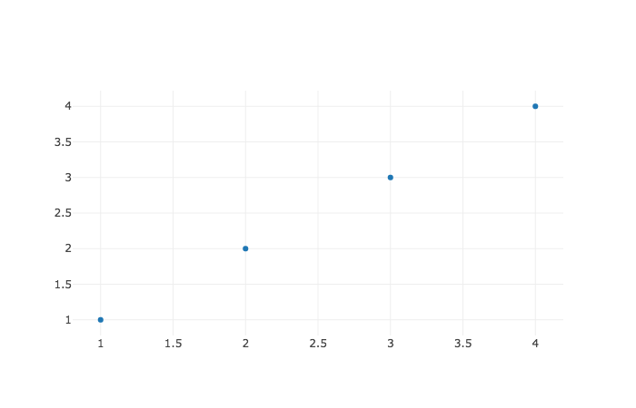
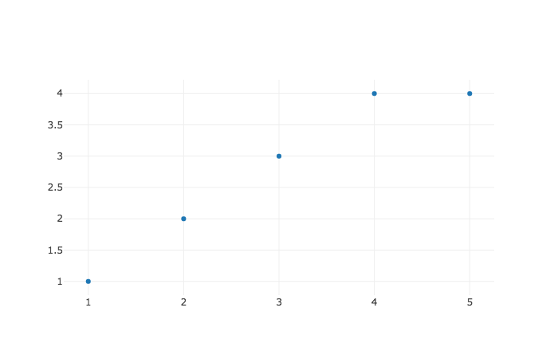
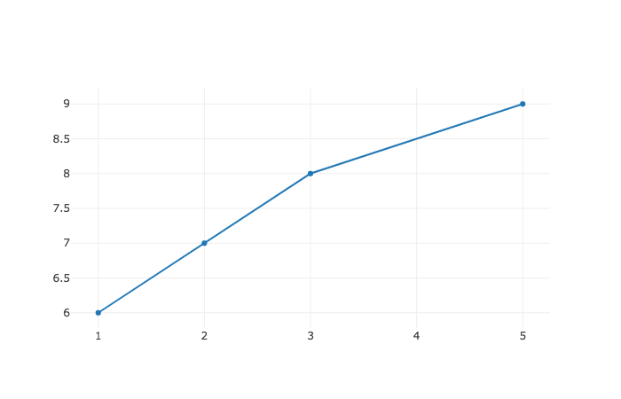
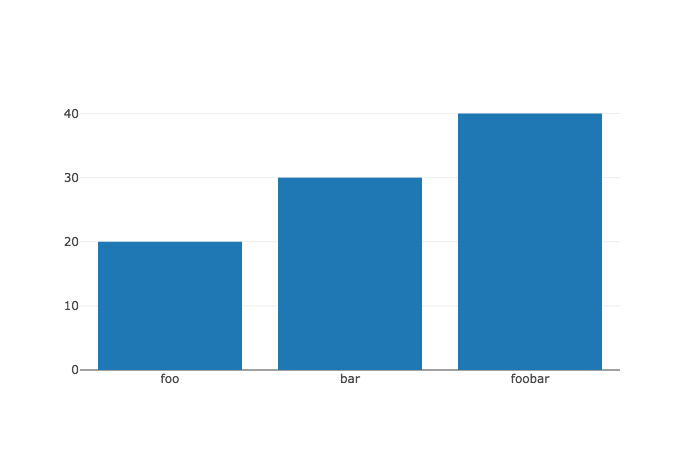
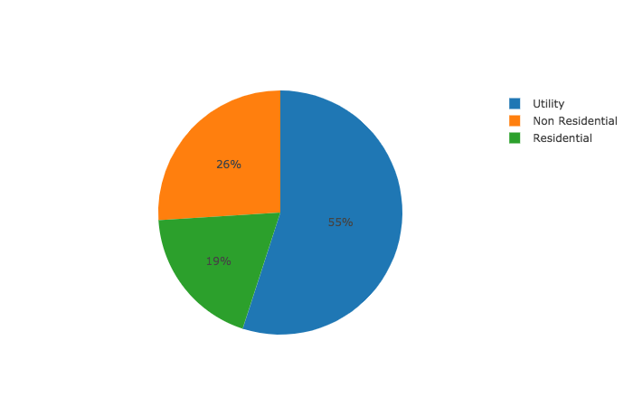
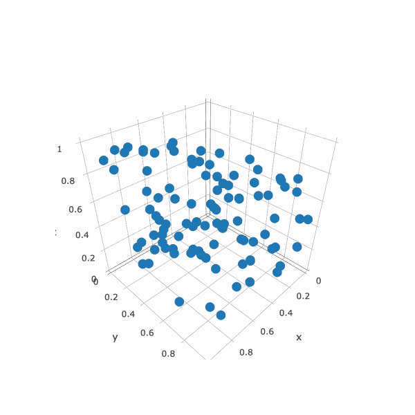

# jutsu 術


jutsu translation: technique, way

Do you want fast data visualization that looks professional without a lot of hassle?

Tired of having to come up with your own ad hoc solution to visualize data remotely?

Then this tool is meant for you! 

(I promise the graphs look a lot better than on this README. Image quality is being reduced for compression reasons I believe.)

The current api is functionally a light wrapper around [plotly.js](https://plot.ly/javascript/).
This way you can follow their conventions for plotting while getting to use EDN instead of JSON. 

The power of jutsu is that it works by sending data to a client just like a website. This has a couple of advantages.

The first is that jutsu works remotely by default, same api for cloud and localhost.

The second is that plotly graphs use javascript for animations and interactivity. This is increasingly becoming the norm for professional data visualization.

Tradeoff:
Every call in this api is a side effect. This is denoted in the naming conventions for the api.

## Getting Started

If you are new to Clojure then follow these instructions, otherwise skip to usage.

Make sure you have java installed

`java -version` if you don't, then install a java SDK such as OpenJDK. 

Then install [boot](https://github.com/boot-clj/boot).
Boot is a build tool for clojure which allows you to run tasks from the command line.

To make sure everything is working run `boot repl` in your command line.

In order to use jutsu you will need to create a build.boot file to add jutsu as a dependency. 
You can follow the instructions on boot's [homepage](https://github.com/boot-clj/boot) to guide you.

## Usage

Add jutsu to your dependencies

```clojure
[hswick/jutsu "0.1.1"]
```

*note* If you are using nightlight you must place nightlight after jutsu in the list of dependencies. This is currently a known bug.

Then include jutsu into your current namespace.

If working in a repl:

```clojure

(require '[jutsu.core :as j])

```
Or if working in a source file:

```clojure
(:require [jutsu.core :as j])
```

Then start using jutsu! 
```clojure
;;This will start up a httpkit server and open the jutsu client in your default browser.
(j/start-jutsu!)
;;If you are running this in a script as opposed to the repl 
;;delay for a bit to let the websocket connect.
;;(Thread/sleep 3000)

```

Each call to jutsu follows a similar function signature [id data]
```clojure
;;Adds a graph to the jutsu client
(j/graph!
  "foo"
  [{:x [1 2 3 4]
    :y [1 2 3 4]
    :mode "markers"
    :type "scatter"}])
```


```clojure  
;;To do realtime updates of a graph
(j/update-graph!  
  "foo"
  {:data {:y [[4]] :x [[5]]} 
   :traces [0]}))
   
```


```clojure
;;You can even view matrix like datasets
(j/dataset! "dataset-foo" 
   [[1 2 3 4] 
    [1 2 3 4] 
    [1 2 3 4] 
    [1 2 3 4]])
```


```clojure
(j/graph! "Line Chart"
  [{:x [1 2 3 5]
    :y [6 7 8 9]
    :type "scatter"}])
```


```clojure

  (j/graph! "Bar Chart"
    [{:x ["foo" "bar" "foobar"]
      :y [20 30 40]
      :type "bar"}])
```


```clojure
  (j/graph! "Pie Chart"
    [{:values [19 26 55]
      :labels ["Residential" "Non Residential" "Utility"]
      :type "pie"}])
```


```clojure
  (j/graph! "3D Scatter"
    [{:x (take 100 (repeatedly #(rand)))
      :y (take 100 (repeatedly #(rand)))
      :z (take 100 (repeatedly #(rand)))
      :type "scatter3d"
      :mode "markers"}]
    {:width 600
     :height 600})
```


Please check out plotly's homepage for a [full set of documented options.](https://plot.ly/javascript/)

## Remote

The nice thing about jutsu being run like a web app is that it works on remote environments by default.

SSH into your remote machine like so:

ssh -L 9002:localhost:4002 USER@IP_ADDRESS

Then in your code (I personally like to use jutsu in the repl) initialize jutsu:

```clojure
(j/start-jutsu! 4002 false)
```

4002 is the port number that jutsu will be serving locally on your remote machine
The third argument we set to false because we don't want it to try to open up the graph
in a web browser automatically.

In your browser on your computer type localhost:9000 as the url.

You should see the jutsu start page if it is all working.

Then when you are ready you can send graphs to this web page and see them immediately. 

## Dev

Run all three commands in separate tabs for optimal dev experience.

`boot night` to edit

`boot dev` to run

`boot repl-client` to connect to repl server started with `boot dev`

Pull requests are very welcome!

## Testing

`boot test-code` to run tests (will reload on resource file changes)

This has the unfortunate side effect of constantly reopening a tab in your browser and can be annoying at times.
Would love advice on how to test this better. 

## Web Socket
Sente receives event via chsk/receive and jutsu uses pattern matching to route the events appropriately.

Dynamically adding more event routes is a possibility, however the coupling between clj(s) makes testing very difficult.
Server side router currently only sends events to the client-side-router. However, functionality for receiving events is planned.


## More
[What jutsu started as](https://github.com/danielsz/sente-boot)

[plotly cheat sheet](https://images.plot.ly/plotly-documentation/images/plotly_js_cheat_sheet.pdf)

[plotly full reference](https://plot.ly/javascript/reference/)

## MIT LICENSE
Copyright 2017 Harley Swick

Permission is hereby granted, free of charge, to any person obtaining a copy of this software and associated documentation files (the "Software"), to deal in the Software without restriction, including without limitation the rights to use, copy, modify, merge, publish, distribute, sublicense, and/or sell copies of the Software, and to permit persons to whom the Software is furnished to do so, subject to the following conditions:

The above copyright notice and this permission notice shall be included in all copies or substantial portions of the Software.

THE SOFTWARE IS PROVIDED "AS IS", WITHOUT WARRANTY OF ANY KIND, EXPRESS OR IMPLIED, INCLUDING BUT NOT LIMITED TO THE WARRANTIES OF MERCHANTABILITY, FITNESS FOR A PARTICULAR PURPOSE AND NONINFRINGEMENT. IN NO EVENT SHALL THE AUTHORS OR COPYRIGHT HOLDERS BE LIABLE FOR ANY CLAIM, DAMAGES OR OTHER LIABILITY, WHETHER IN AN ACTION OF CONTRACT, TORT OR OTHERWISE, ARISING FROM, OUT OF OR IN CONNECTION WITH THE SOFTWARE OR THE USE OR OTHER DEALINGS IN THE SOFTWARE.